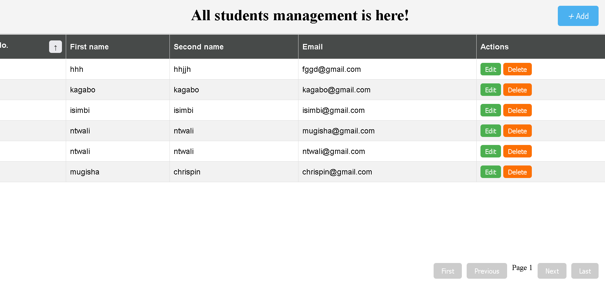

# Datum: Data Management App
🎉 Welcome to Datum! PHP||SweetAlert||Mysql

This is a user-friendly data management application designed to efficiently manage student records.
It integrates both backend and frontend technologies to ensure seamless performance and an intuitive user experience.
Technologies Used
Backend:

PHP: Handles server-side logic and communication with the database.
Apache: Serves the application efficiently.
MySQL: Stores and manages all the student records.

Frontend:

JavaScript: Provides interactive functionality for user actions.
SweetAlert: Enhances user notifications with beautiful, customizable alerts.

Database Setup
📧 For assistance:

Feel free to email us at: mugishachrspin590@gmail.com
Step: Import the Students Table

📥 Command to Import Students Table:

Run the following command to load the students.sql file into the database:

    mysql -u root students < path/to/students.sql

This command will populate the students database with the required table and data.
Enjoy managing your student data! 🎓

If you encounter any issues, don’t hesitate to reach out via the email provided above.

# Happy Coding! 🚀
